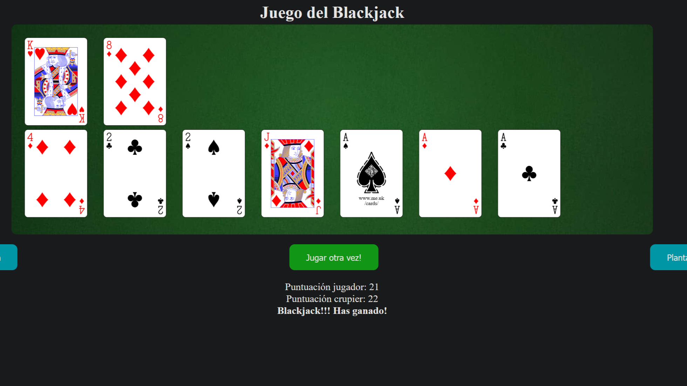

# Blackjack en Java Script

Juego Blackjack usando HTML5, CSS y JS.

Muestro las cartas en un canvas de HTML5 y cada carta es un objeto JS.

## Fuente de imagenes

Las imagenes usadas para las cartas vienen de wikipedia: [Wikipedia](https://commons.wikimedia.org/wiki/Category:SVG_playing_cards)

# Video

Para entender el codigo hay un video explicativo en YouTube:

